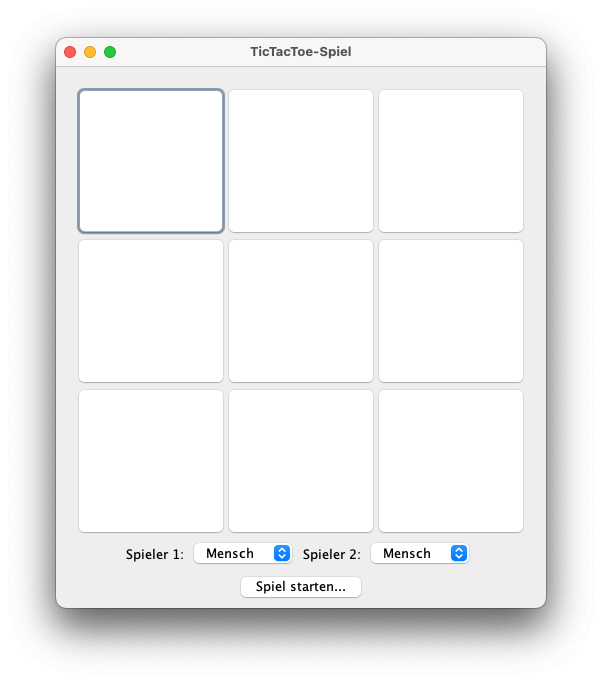
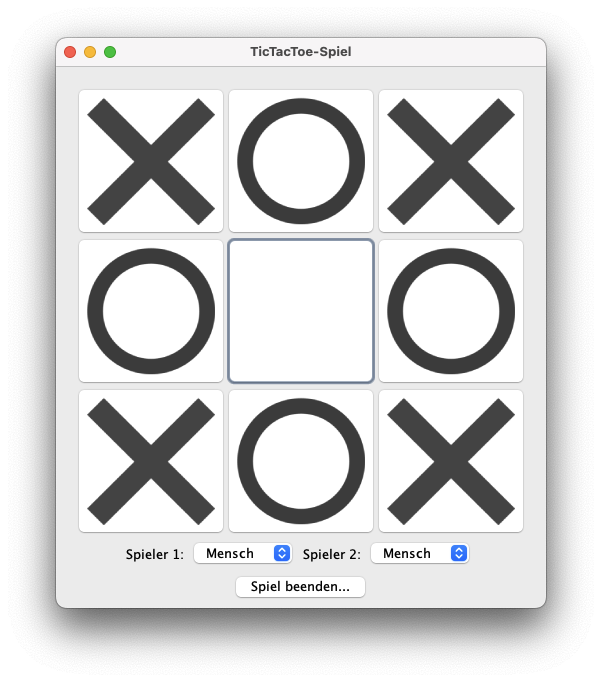

# TicTacToe mit Swing-GUI

## Überblick

Dieses TicTacToe-Spiel wurde in Java unter Verwendung des Swing-Frameworks für die grafische Benutzeroberfläche erstellt.  
Es bietet eine einfache und intuitive Benutzeroberfläche, in der die Spieler zwischen verschiedenen Modi wählen können.

  
   

## Funktionsweise

Das Spiel besteht aus einem 3x3-Spielbrett, auf dem die Spieler abwechselnd ihre Züge machen.  
Das Ziel des Spiels ist es, drei gleiche Symbole (Kreuz oder Kreis) in einer Reihe, Spalte oder Diagonalen zu haben.

### Spielmodi's

- **Mensch gegen Mensch:** In diesem Modus können zwei Spieler auf demselben Gerät gegeneinander antreten.
- **Mensch gegen Computer:** Ein Spieler tritt gegen den Computer an. Der Computer kann entweder zufällige Züge machen oder den Minimax-Algorithmus verwenden.

### KI (Künstliche Intelligenz)

Die KI-Logik für den Computer ist in zwei Modi unterteilt:

- **Zufällig:** In diesem Modus macht der Computer einen zufälligen Zug.
- **Minimax:** Der Minimax-Algorithmus wird verwendet, um den besten möglichen Zug zu finden. Dieser Algorithmus berücksichtigt alle möglichen Züge und wählt den besten aus, basierend auf einer Bewertungsfunktion.

## Dateistruktur

- `Main.java`: Die Hauptausführungsklasse, die das Spiel startet.
- `TicTacToe.java`: Enthält die Hauptlogik und GUI für das Spiel.
- `Algorithm.java`: Enthält die Logik für die KI-Strategien (zufällig und minimax).

## Ausführung

Um das Spiel zu starten, führen Sie die `Main.java`-Datei aus.

## Lizenz

Dieses Projekt steht unter der MIT-Lizenz. Weitere Informationen finden Sie in der `LICENSE`-Datei.